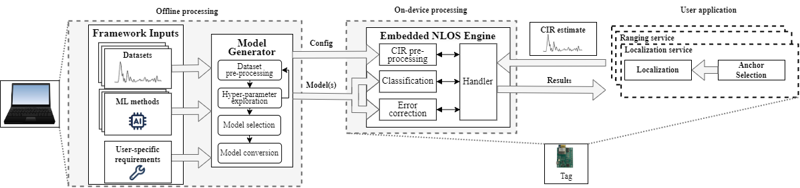

# InSight

The InSight framework enables non-line-of-sight (NLOS) classification, error correction, and anchor selection on resource-constrained UWB (ultra-wideband) devices. The [Model Generator](Model Generator/readme.md) module is designed to fascilitate the creation and deployment of efficient machine learning models that meet user-specific requirements (RAM, flash memory, and runtime) and convert the best model to C code. The [Embedded NLOS Engine](Embedded NLOS Engine/readme.md) module then uses the models to provide NLOS classification and error correction to any service. In this example we build the embedded NLOS engine into the Contiki-NG operating system.

InSight is designed to be configurable and the components exchangeable. Feel free to add, modify, or exchange any part to better suit your needs. 




## Citation
For detailed information, feel free to read the full paper [InSight: Enabling NLOS Classification, Error Correction, and Anchor Selection on Resource-Constrained UWB Devices](http://www.carloalbertoboano.com/documents/gallacher23insight.pdf), and if you use our repository, we would appreciate a citation.
```
@inproceedings{gallacher23insight,
  author = {Markus Gallacher and Michael Stocker and Michael Baddeley and Kay R\"{o}mer and Carlo Alberto Boano},
  title = {{InSight: Enabling NLOS Classification, Error Correction, and Anchor Selection on Resource-Constrained UWB Devices}},
  booktitle = {Proceedings of the $20^{th}$ International Conference on Embedded Wireless Systems and Networks ({EWSN})},
  pages = {},	
  location = {Rende, Italy}, 
  month = sep,	
  year = {2023},
  publisher = {ACM},
  isbn = {},
  doi = {},	
};
```
